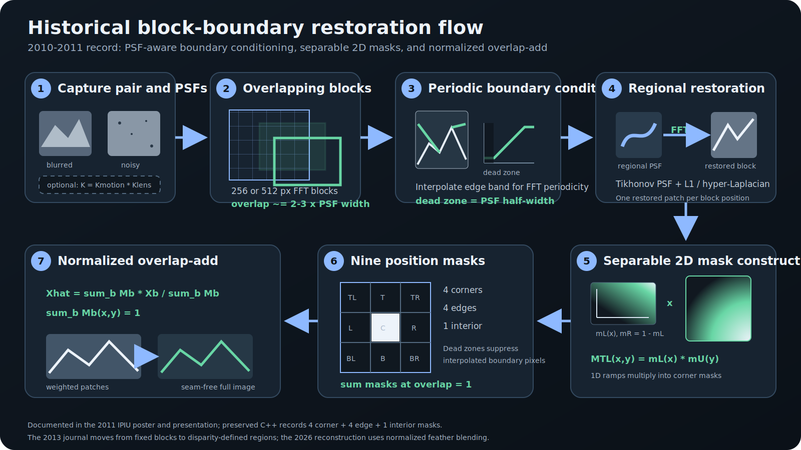

# Disparity-based Space-Variant Image Deblurring


## Project status

This repository preserves three distinct records:

* **Published 2013 paper.** The original paper remains available at [Disparity_Based_Space_Variant_Image_Deblurring.pdf](Disparity_Based_Space_Variant_Image_Deblurring.pdf).
* **Historical 2009–2011 figures and evidence.** The figures below are retained at their original `readme_pic/` paths as historical research evidence. They are not a newly generated benchmark.
* **2026 modern reference reconstruction.** `src/disparity_deblur` is a clean, reproducible reference implementation inspired by the paper. It is **not** the exact deleted original implementation and is not bit-identical to historical outputs.

## 2013 paper record · 2026 reference reconstruction

| 2013 paper record | 2026 reference reconstruction |
| --- | --- |
| Blurred/noisy capture pair → Harris/LK disparity → color graph-cut over-segmentation → adjacent disparity-region merge → regional gradient-domain Tikhonov PSF → kurtosis validation/replacement → L1/FFT regional restoration → region merge. | Deterministic Python reconstruction with RANSAC homography, graph-cut/disparity-median merge, regional Tikhonov kernels, TV/L1 FFT deconvolution, normalized feather blending, and optional guided noisy-detail fusion. |

The reconstruction maps these stages visibly in the featured Mat3 walkthrough below. Guided noisy-detail fusion is a 2026 reconstruction enhancement; it is not claimed as part of the deleted 2013 implementation and outputs are not bit-identical to historical results.

## Quickstart

Python 3.11+ and [uv](https://docs.astral.sh/uv/) are required.

```sh
uv sync
uv run disparity-deblur \
  --blurred benchmarks/public-assets/gopro-flower/blurred.png \
  --noisy benchmarks/public-assets/gopro-flower/noisy.png \
  --output-dir output/gopro-flower
```

Reproduce the public manifest-driven showcase in a separate output directory:

```sh
uv run disparity-deblur-benchmark \
  --manifest benchmarks/manifests/public.json \
  --dataset-root benchmarks/public-assets \
  --output-dir output/showcase
```

## Featured living-room restoration walkthrough

The authorized Mat3 living-room scene is a step-by-step record of the modern reconstruction:
blurred and noisy inputs, RANSAC registration, feature/disparity vectors, graph-cut
regions, disparity-merged regions, regional kernels, deconvolution, and the selected
HPO final restoration. Web-sized intermediates, checksums, and selected HPO settings are
in [`benchmarks/public-assets/mat3-living-room/walkthrough.json`](benchmarks/public-assets/mat3-living-room/walkthrough.json);
the visual walkthrough is on the [project site](docs/index.html).

Mat3 has no clean ground truth. Its selected final proxy score is **0.874256** and proxy
SSIM is **0.919059**, measured against the registered, non-local-means-denoised noisy
auxiliary; these are not PSNR claims. The selected HPO uses 12 color labels, disparity
threshold 1.0, 17px kernels, 192px patches, Tikhonov 0.001, data weight 60, beta 8,
feather sigma 12, unsharp amount 0.3, and guided detail-fusion amount 0.5.

## Reproducibility and public benchmark gallery

The committed public showcase was generated from `benchmarks/manifests/public.json`; its `benchmark.json` records relative asset paths, checksums, selected HPO configuration, and metrics without recording local dataset paths. Comparisons are ordered **blurred + noisy -> restored -> reference**.

| Public dataset | Metric type | PSNR | SSIM | Objective (full-resolution) |
| --- | --- | ---: | ---: | ---: |
| Hyeon Sang Jeon historical: object motion | no-reference proxy | N/A | N/A | 0.632094 |
| Hyeon Sang Jeon historical: low-light building | no-reference proxy | N/A | N/A | 0.640904 |
| Hyeon Sang Jeon historical: parking | no-reference proxy | N/A | N/A | 0.750229 |
| External GoPro-derived benchmark | reference-backed | 25.3705 | 0.8816 | 0.694603 |

See [showcase/benchmark/SUMMARY.md](showcase/benchmark/SUMMARY.md), [showcase/benchmark/benchmark.json](showcase/benchmark/benchmark.json), and the framework-free [GitHub Pages site](docs/index.html) for the complete public gallery. These results are reference-reconstruction measurements, not claims about the deleted historical code.

<details>
<summary><strong>Optional historical article · Block-boundary blending (2011)</strong></summary>

The 2011 IPIU poster **“다중영상을 이용한 블록기반 디블러링 알고리즘에서 효율적
경계면 결함제거방법”** lists **Hyeon Sang Jeon first**, followed by Chang-Hwan Son
and Hyung-Min Park. It documents the implementation path that preceded the journal's
disparity-defined regions:

1. split the blurred/noisy pair into overlapping 256 or 512 pixel FFT blocks;
2. linearly condition a PSF-width boundary band to reduce periodic-boundary ringing;
3. restore each block with its estimated PSF;
4. discard the conditioned-only pixels with a PSF-half-width dead zone;
5. multiply horizontal and vertical 1D ramps into 2D corner masks; and
6. combine four corner, four edge, and one interior mask with normalized overlap-add.



The recovered C++ preserves the same lineage in
`BoundaryEdgeSmoothing_LinerInterpolation`, the nine block-position masks, and
weighted `BlockSumImage` accumulation. This is a historical implementation record,
not a claim that the 2026 reference reconstruction is the deleted original. The
modern pipeline uses normalized feather blending to generalize the same merge
principle to disparity-defined content regions.

</details>

## Data and licenses

Code is MIT licensed. Historical photographs are © Hyeon Sang Jeon, all rights
reserved. The external GoPro-derived benchmark
is CC BY 4.0; detailed attribution is in [THIRD_PARTY_LICENSES.md](THIRD_PARTY_LICENSES.md) and
[ATTRIBUTION.json](benchmarks/ATTRIBUTION.json). Cite the reconstruction via
[CITATION.cff](CITATION.cff) and the historical work via the [paper
PDF](Disparity_Based_Space_Variant_Image_Deblurring.pdf).

The gallery contains web-sized PNG inputs and generated WebP comparisons only;
RAW captures are not distributed.

## Citation

Use [CITATION.cff](CITATION.cff) to cite this software reconstruction. For the historical work, cite the preserved [2013 paper PDF](Disparity_Based_Space_Variant_Image_Deblurring.pdf).

## Abstract 
Obtaining a good-quality image requires exposure to light for an appropriate amount of time. If there is camera or object motion
during the exposure time, the image is blurred. To remove the blur, some recent image deblurring methods effectively estimate
a point spread function (PSF) by acquiring a noisy image additionally, and restore a clear latent image with the PSF. Since the
groundtruth PSF varies with the location, a blockwise approach for PSF estimation has been proposed. However, the block to
estimate a PSF is a straightly demarcated rectangle which is generally different from the shape of an actual region where the PSF
can be properly assumed constant. We utilize the fact that a PSF is substantially related to the local disparity between two views.
This paper presents a disparity-based method of space-variant image deblurring which employs disparity information in image
segmentation, and estimates a PSF, and restores a latent image for each region. The segmentation method firstly over-segments a
blurred image into sufficiently many regions based on color, and then merges adjacent regions with similar disparities. Experimental
results show the effectiveness of the proposed method.
- Keywords: Image deblurring, space-variant deblurring, disparity, segmentation, point spread function, deconvolution
## Contents
1. Blur modeling in convolution-based images
2. Introduction and problem of existing deblurring method using multiple images
- &nbsp; Spatial invariant de-blurring method using multiple images
- &nbsp; Block-based spatial variable debloring method using multiple images
3. Proposed spatially variable deblurring algorithm based on disparity-based Image segmentation using multi-image
- &nbsp; image segmentation method using multiple images
- &nbsp; PSF(Point Spread Function) estimation method by disparity using multiple images
- &nbsp; image restoration method by disparity of space variant using multiple images
4. Algorithm result and comparison with existing method
5. Conclusion
---------------------------------------

## citation count : 13 [(from ~ 2024.09.12 now)](https://scholar.google.co.kr/scholar?um=1&ie=UTF-8&lr&cites=5448354229558601854)
  
### Blur modeling in convolution-based images
The blurred image is modeled as a linear combination of PSF, which is the trajectory of camera shake and sharp image.


Blind deconvolution is illposed problem
* The problem of general image blurring should be estimated by PSF and latent image.
* The problem with image restoration is that there is not enough information compared to the solution of the function.


---------------------------------------
### Introduction to existing methods

##### General Method to Eliminate Space Invariant Blur using Multiple Images
Assuming that the edge distribution of the noise image is similar to the edge distribution of the clear image, PSF estimate.

It is assumed that the blurring of the image is independent of the spatial position or the amount of movement of the subject and causes the same blurring.  


##### Issue of Space Invariant Deblurring Method
The blurred of a typical real image differs spatially in the amount of blur.
PSF estimated from the whole image can not guarantee a stable result when the image is restored because different spreading degree according to the space is not considered.


#### Block-based Spatial Variability Deblurring Method Using Multiple Images
Assuming that the blurring of the image depends on the spatial location to object.
Segmentation of blurred image by block, PSF estimation and image restoration by each region[2].


Stable PSF estimation is impossible in the case of a block including a content including a sudden change in the amount of motion of the subject.
The PSF estimation and substitution method considering only the entropy of the neighboring block [2] does not consider the amount of blurring according to the amount of movement of the subject.


---------------------------------------
### Proposed Image Deblurring Method
Image Segmentation Space Variable Algorithm Based on the Motion Amount of Images.


#### Disparity-Based Image Segmentation
The distances to the moving distance of the acquisition time difference between the blurred image and the noise image are calculated. 


The disparity distance result of feature point of blurred image and noise image.
Movement amount differs depending on the position of the subject in the image.


Approximate content-based initial segmentation using graph cut method [4].


Then, Assigning the feature points corresponding to the initial partition using the graph cut to each area.


Compute the median of the disparity distance of minutiae by partition and then substitute the median value of the partition value. 


Merge division value in error by setting error of substituted disparity distance.


---------------------------------------
### Proposed Regional PSF Estimation 
Estimation of PSF considering the amount of spatial variable spreading by segment depth according to image depth.
* Estimation method used by Tikhonov method [1].
  * PSF estimation uses x and y differential images of the segmented region.


In the masked partial differential image, the block with the largest absolute value of the edge is scanned and the PSF is estimated.


PSF estimation result of segmented edge image by contents


Partial images with relatively coarse-grained distributions filter the PSF below a certain threadhold by the distribution of PSF using kurtosis and replace with the PSF of the most similar depth information. 
The general PSF has a very high kurtosis distribution and the kurtosis of PSFs that fail to estimate is relatively low.
* Kurtosis low threshold=20 / high threshold=300


 ---------------------------------------

## Image Reconstruction method by disparity area
Merge by partition after reconstruction of each segment image using hyper-Laplacian method.
In this section, we describe image reconstruction using the blurred image
and the estimated regional PSFs. We first restore a latent image of each
segmented region by performing deconvolution of each region of the blurred
image with the corresponding PSF, and then merge all the reconstructed regions
into one (see Fig. 1). For each regional image reconstruction, we use an
FFT-based method of hyper-Laplacian regularization (p(x) ∝ exp (−k|x|^α)
where 0 < α ≤ 1) [14], and we choose L1 regularization (α = 1).


The above FFT-based deblurring is fast, and the use of L1 norm for regularization
preserves strong edges.
Performing deconvolution of an extremely smooth region with the estimated
PSF may cause undesirable artifact without apparent enhancement.
Protecting such smooth regions have been investigated in [32, 33] for image
restoration and sharpening, respectively.


---------------------------------------
## Experimental Results
We have used a DSLR camera (Nikon D7000) and two compact digital cameras (Samsung VLUU ST5000 and Canon Digital IXUS 110 IS) to capture real images.


### Results for artificially generated images
We made an artificial blurred image from a fairly-captured input image of
1365×1024 resolution (with exposure time of 1/50 second, relative aperture
of f/9, and ISO 1600 from Nikon D7000) and spatially-different artificial blurkernels.


PSF estimate result(block size 33x33)


The proposed method reduces the ringing artifact per spatial and improves the sharpness of the edge compared to the spatial invariant restoration method


PSNR for each RGB channel of restored image


Restoration result of patch according to distance


### Results for captured real images
We have captured a pair of images whose resolution is 1365×1024: a
blurred image under long exposure and low ISO and a noisy image under
short exposure and high ISO. They are sequentially captured under a usual
hand tremor in the bracketing mode of the camera. Figure 10 shows the pair
of blurred image and registered version of noisy image. Their exposure times,
f-numbers, and ISO settings are shown in Table 2 (row of three objects).


## Conclusion
We presented a disparity-based deblurring algorithm using a pair of noisy
and blurred images. Our algorithm adequately segments the image into regions
by initial graph-cut over-segmentation based on color, and disparitybased
merging. For each region a PSF is estimated, and a regional latent
image is restored. Finally the restored regional images are merged into a latent image. 
The experimental results of artificial and real sets of blurred and 
noisy images have shown that our algorithm attains better qualities than
the two existing distinguished methods. The proposed method is particularly 
useful for images with high variation of disparity.

* The disparity distance between actual images is different depending on the distance between the camera and the subject or the movement of the internal subject.
* When dividing by disparity, it is possible to divide by the accurate content considering the movement of the object by using the image segmentation and merging method based on the moving amount of the proposed multiple images.
* Possible to estimate the blurring of the image based on the amount of motion using the proposed efficient partition. 
* Compared to the conventional method, it can correct the defective ringing artifacts and obtain clear images by using exact PSF for each region of image. 


## Reference
- `[1].` L. Yuan, J. Sun, L. Quan, and H. Shum, “Image Deblurring with Blurred/Noisy Image Pairs,” ACM Trans. on 	Graphics, vol. 26, no. 3, pp. 1-10, Aug. 2007.
- `[2].` M. Sorel and F. Sroubek, “Space-variant deblurring using one blurred and one underexposed image,” 16th  IEEE 	International Conference on Image Processing, pp. 157-160, 2009.
- `[3].` B. D. Lucas and T. Kanade, “An iterative image registration technique with an application to stereo vision”, in 	Proc. 7t h IJCAI, Vancower, B. B., Canada, pp. 674-679, 1981.
- `[4].` Y.Boykov and V.Kolmogorov, “An experimental comparision of min-cut/max-flow algorithms for 	energy minim- 	ization in vision,” IEEE Transactions on Pattern Analysis and Machine Intelligence, vol. 26, no. 9, pp. 	1124-1137, 2004. 
- `[5].` D. Krishnan and R. Fergus, "Fast image deconvolution using hyper-Laplacian priors,” Neural  Information Proc- 	essing Systems, vol. 22, pp.1-9, 2009.
- ...
- `[14].`D. Krishnan, R. Fergus, Fast image deconvolution using hyper-Laplacian priors, in: Proc. Neural Inf. Process. Syst., pp. 1033–1041.
- ...
- `[32].`C. Wang, Z. Liu, Total variation for image restoration with smooth area protection, J. Signal Process. Syst. 61 (2010) 271–277.
- `[33].`A. Polesel, G. Ramponi, V. Mathews, Image enhancement via adaptive unsharp masking, Image Processing, IEEE Transactions on 9 (2000) 505–510.
